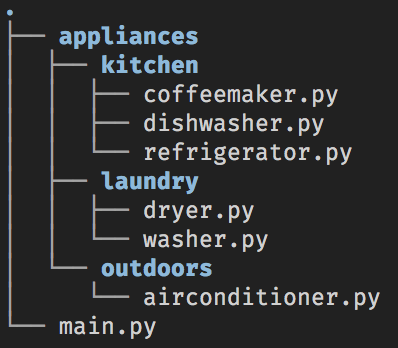

# Packages

Python packages are a way to collect many classes into a single namespace. 
Consider the following directory structure for containing classes representing different electronic appliances.




In order to use those in the `main.py` module, this is what the `import` statements would look like.

```py
from appliances.kitchen.coffeemaker import CoffeeMaker
from appliances.kitchen.dishwasher import DishWasher
from appliances.kitchen.refrigerator import Refrigerator

from appliances.laundry.dryer import Dryer
from appliances.laundry.washer import Washer

from appliances.outdoors.airconditioner import AirConditioner

kenmore = Washer()
samsung = Refrigerator()
```

Since all of those are appliances, but you defined a directory structure to organize them in your project more logically, it makes the imports more complex. 
What Python packages allow you to do is provide an abstraction so that external code does not have to rely on knowledge about your directory structure.

You collect all of those classes into a single namespace. The goals is to make the import statements access the same namespace.

## Package \_\_init__

The first step is to place an `__init__.py` file in the appliances directory. Then you import all of the classes into that module.

> #### `appliances/__init__.py`

```py
from appliances.kitchen.coffeemaker import CoffeeMaker
from appliances.kitchen.dishwasher import DishWasher
from appliances.kitchen.refrigerator import Refrigerator

from appliances.laundry.dryer import Dryer
from appliances.laundry.washer import Washer

from appliances.outdoors.airconditioner import AirConditioner
```

## Using the Package

Now your main module can access all of the appliance classes from a single package.

```py
from appliances import CoffeeMaker, DishWasher, Refrigerator, Dryer, Washer, AirConditioner

kenmore = Washer()
samsung = Refrigerator()
```

You can also make it more readable by putting the import statements on separate lines.

```py
from appliances import CoffeeMaker
from appliances import DishWasher
from appliances import Refrigerator
from appliances import Dryer
from appliances import Washer
from appliances import AirConditioner

kenmore = Washer()
samsung = Refrigerator()
```

## Practice: Importing Packages
Clone this repo and refactor it to make it run error-free. Run `index.py` and use the error message to figure out where to start. 
Once the errors are gone, create a can opener and open a can (But hold your nose!)

https://github.com/nashville-software-school/python-imports
